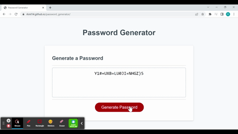

# Challenge 02 - PASSWORD GENERATOR

## Description 
Created an application that will enable employees to generate random passwords based on criteria that they’ve selected (password length, uppercase, lowercase, numeric & special characters).  This app runs in the browser and features dynamically updated HTML and CSS powered by JavaScript code.  

The following image shows the web application's appearance. Once the user clicks on the red button "Generate Password", the application will begin.  

>

Gif demonstrating the steps of a successfully created password:

---
## Usage
Used to create a random password based on the following criteria
 - User inputed length from between 8 to 128 characters long
 - User to confirm if they want to include lowercase
 - User to confirm if they want to include uppercase
 - User to confirm if they want to include numeric characters
 - User to confirm if they want to include special characters

 The password generator will not allow the user to input non-integer values for a password length, and will return an invalid message if the user attempts to pick no character types for their password. 

---
## Installation
n/a

---
## Author

Rebecca Lawrence
Rebecca Lawrence (https://github.com/rkml14/)

Live site: (https://rkml14.github.io/password_generator/)

